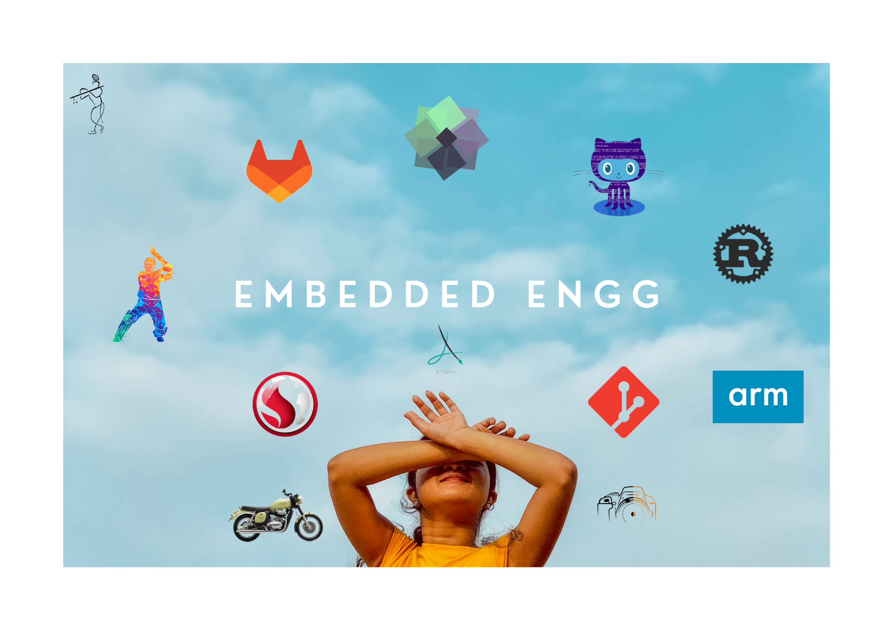

<!--.png?raw=true)-->

<h1 align="center">Hi , I'm Skrishnan </h1>

 I'm an Embedded Engineer working on Board Support package

### 🛠 &nbsp;Tech Stack

    <code></code>
    <code></code>
    <code></code>
    <code></code>
    <code></code>
    <code></code>
    <code></code>
    <code></code>
    <code></code>
    <code></code>
    <code></code>
    <code></code>
    <code></code>

 

📈 My GitHub Stats

<table style="border-collapse: collapse; border: none">
    <tr style="border: none">
        <td style="border: none">
            
        </td>
        <td style="border: none">
            
        </td>
   </tr>
</table>

### :link: &nbsp;Connect with me

<!-- 

  

 -->
<!--
   **skrishnan2001/skrishnan2001** is a ✨ _special_ ✨ repository because its `README.md` (this file) appears on your GitHub profile.
   
   - 🔭 I’m currently working on ...
   - 🌱 I’m currently learning ...
   - 👯 I’m looking to collaborate on ...
   - 🤔 I’m looking for help with ...
   - 💬 Ask me about ...
   - 📫 How to reach me: ...
   - 😄 Pronouns: ...
   - ⚡ Fun fact: ...
   -->
